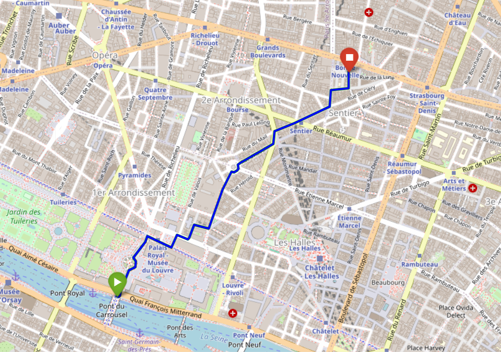

# 🛰️ AI-Based Geolocation System for Smart Mission Tracking

Welcome to the AI-Based Geolocation platform designed to track, validate, and report GPS-based missions using real-time data, machine learning, and automated analytics. This end-to-end system helps verify missions, detect anomalies, and generate professional reports for transparent and sustainable tracking.

[Live Repository](https://github.com/MeetStark34/AI-Based-Geolocation)

---

## 🚀 Features

- ✅ **Real-time GPS Tracking API** via Flask  
- 🧭 **Route Simulation** using OpenRouteService  
- 🧠 **AI-Powered Anomaly Detection** with ML and rule-based checks  
- 📊 **Mission Feature Extraction** (distance, duration, speed, area, etc.)  
- 🗺️ **Map Visualization** with off-road analysis using Folium  
- 📄 **Automated PDF Reports** with detailed mission summaries  

---

## 🧩 Project Structure

```
Egerine_Project/
├── requirements.txt                       # List of required Python packages
├── backend/
│   ├── app.py                             # Flask API for receiving GPS data
│   ├── simulate_route_ors.py              # Simulates a cycling route via ORS
│   └── tempCodeRunnerFile.py              # Temporary file for testing
├── data/
│   ├── gps_data.csv                       # Incoming GPS logs
│   ├── mission_dataset.csv                # Training dataset with labels
│   └── validation_results.csv             # Anomaly detection results
├── models/
│   └── anomaly_model.pkl                  # Trained RandomForest model
├── reports/
│   └── Mission_Report_mission_road_3.pdf  # Auto-generated PDF mission report
├── scripts/
│   ├── detect_anomalies.py                # Detects anomalies in route data
│   ├── generate_report.py                 # Creates PDF reports for each mission
│   └── train_anomaly_model.py             # Trains the anomaly detection ML model
├── visuals/
│   ├── map_screenshot_mission_road_3.png  # Screenshot of the mission route
│   ├── offroad_map_mission_road_3.html    # Interactive map visualization
│   └── speed_graph_mission_road_101.png   # Speed graph visualization
```

---

## 📄 Example Report and Visualization

### 📄 Mission Report

Below is an example of an auto-generated mission report:

[📄 View Mission Report (Mission_Report_mission_road_3.pdf)](Egerine_Project/reports/Mission_Report_mission_road_3.pdf)

### 🗺️ Mission Route Screenshot

Here is a screenshot of the mission route visualization:



---

## ⚙️ Getting Started

### 1. Clone the repository

```bash
git clone https://github.com/MeetStark34/AI-Based-Geolocation.git
cd AI-Based-Geolocation
```

### 2. Install dependencies

```bash
pip install -r requirements.txt
```

> Required Python packages:  
`flask, pandas, joblib, scikit-learn, fpdf, folium, shapely, openrouteservice`

### 3. Set your configuration

Update the API keys and credentials in:
- `simulate_route_ors.py` → `ORS_API_KEY`
- `email_report_sender.py` → SMTP details

---

## 🛰️ Running the Pipeline

Run the components in this order:

```bash
python backend/app.py                   # Start Flask API server
python backend/simulate_route_ors.py    # Simulate GPS data
python scripts/detect_anomalies.py      # Detect mission anomalies
python scripts/generate_report.py       # Generate PDF report
python scripts/email_report_sender.py   # Send PDF via email
```

---

## 🧠 Training the AI Model

```bash
python scripts/train_anomaly_model.py
```

---

## 📦 Included Data

- `gps_data.csv` – Recorded GPS logs  
- `validation_results.csv` – Anomaly detection output  
- `mission_dataset.csv` – Training dataset with labels  

---

## 📜 License

This project is licensed under the **MIT License**.

---

## 🤝 Contributions

PRs and feedback are welcome. Feel free to fork the repo and enhance it!

---

## 📌 Project Collaboration Resources

- 📊 **Task Tracker (Excel)** – Track our progress throughout the project  
  [View on Google Sheets](https://docs.google.com/spreadsheets/d/1fPAfYsuO0hg9GVIQqnLlMjYiZYmiT3HKJWhsfhRwkA4/edit?gid=0#gid=0)

- 📝 **Collaborative Notes (Word Doc)** – Team ideas, updates, and questions  
  [View on Google Docs](https://docs.google.com/document/d/13Z5dHpauR-gyx7rJ2-GaRQZZ_9XANOJwROLwFUh8-Ic/edit?tab=t.1ei18vfcf59n)

---

## 👥 Team Members

| Name              | Email                          |
|-------------------|--------------------------------|
| Meet Stark        | starkmeet@gmail.com            |
| Dhruvilsinh Rathod| dhruvilsinhrathod24@gmail.com  |
| Harshika Singh    | harshikasingh538@gmail.com     |
| Krishna Butani    | krishnabutani7@gmail.com       |
| Kharv Bhavsar     | kabirb1612@gmail.com           |
